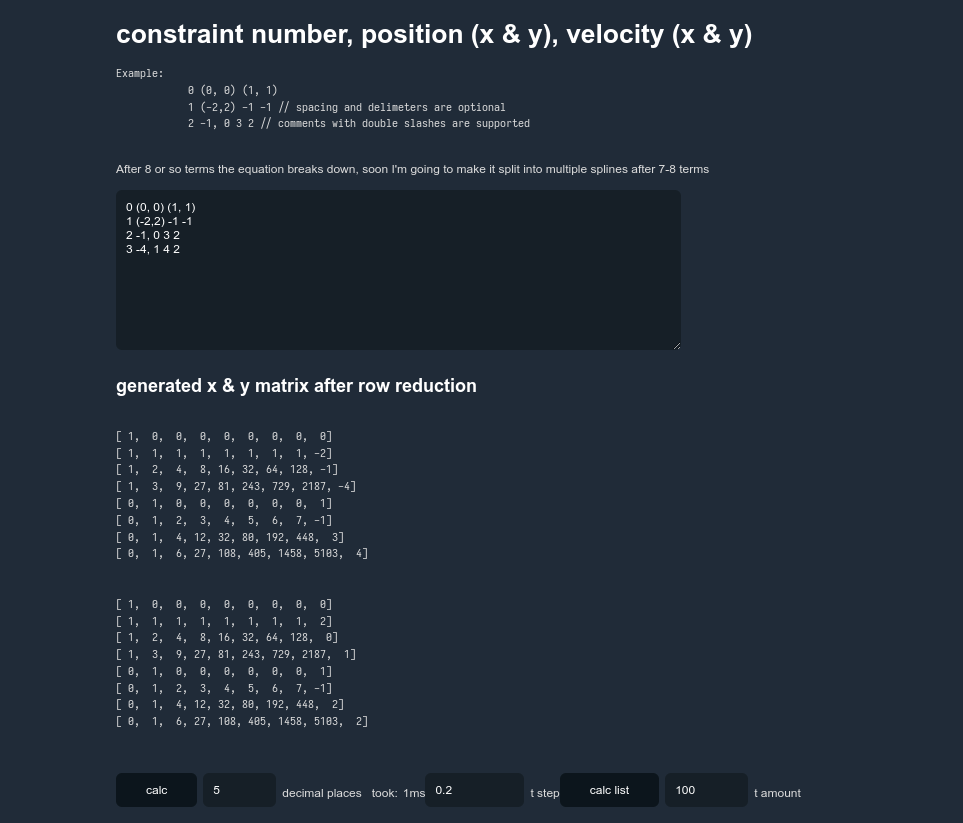
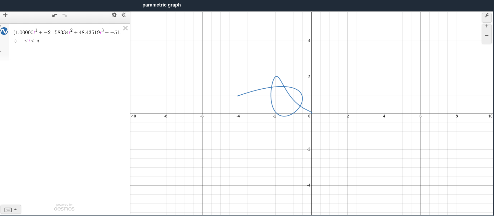

#### spline generator

Given a set of constraints (i.e. coordinates or velocity vectors) the generator uses [rref](https://en.wikipedia.org/wiki/Row_echelon_form) to compute a polynomial that fulfills the given constraints. The rref implementation is written in [Rust WASM](https://www.rust-lang.org/what/wasm) and is given values parsed by some JS, at the moment there are several ways to input the constraints, but eventually I'm going to add a method to import a CSV file from Excel/Google Sheets. 

Using this you can also generate a list of points from the X and Y equations, the calculator creates a desmos embed with the resulting equation.

This method works until 7-8 terms until the equation breaks down, if needed you can chain splines with known ending/starting velocities and positions. In the future I'll make it do this automatically.

